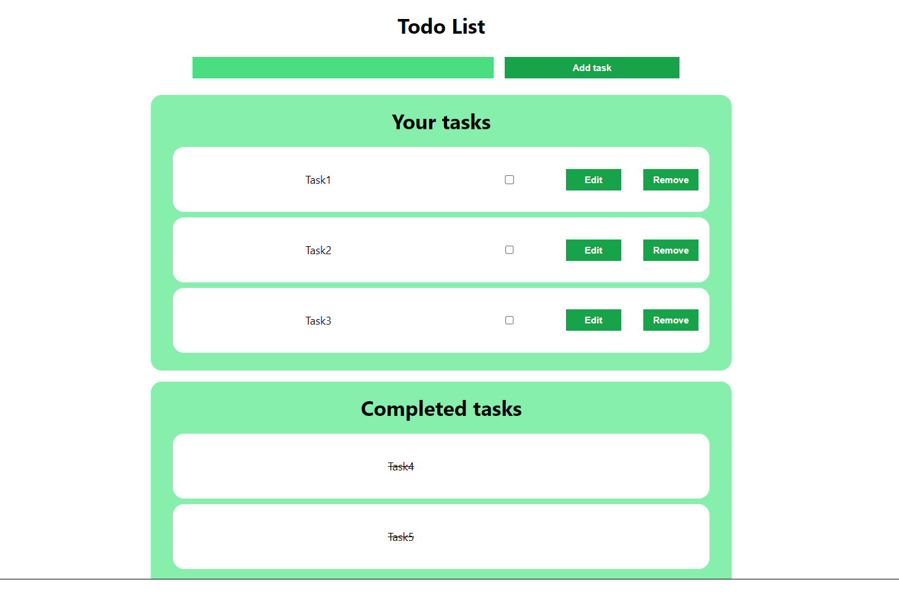
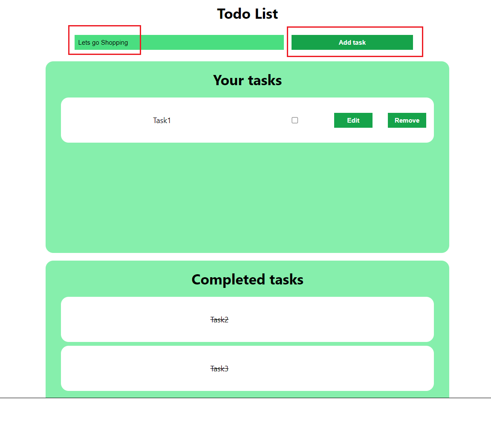
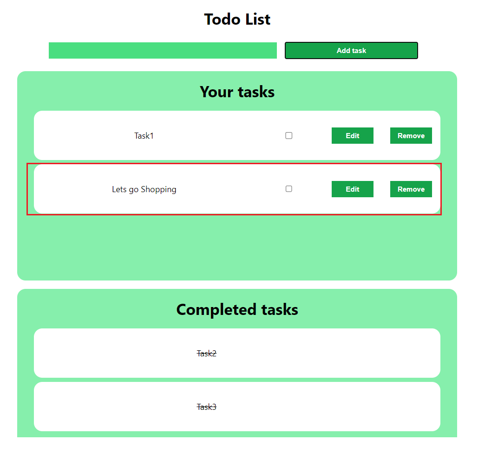
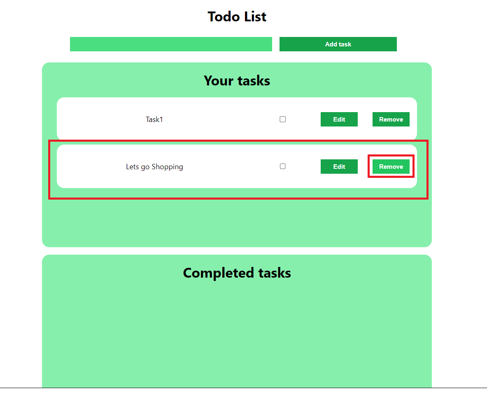
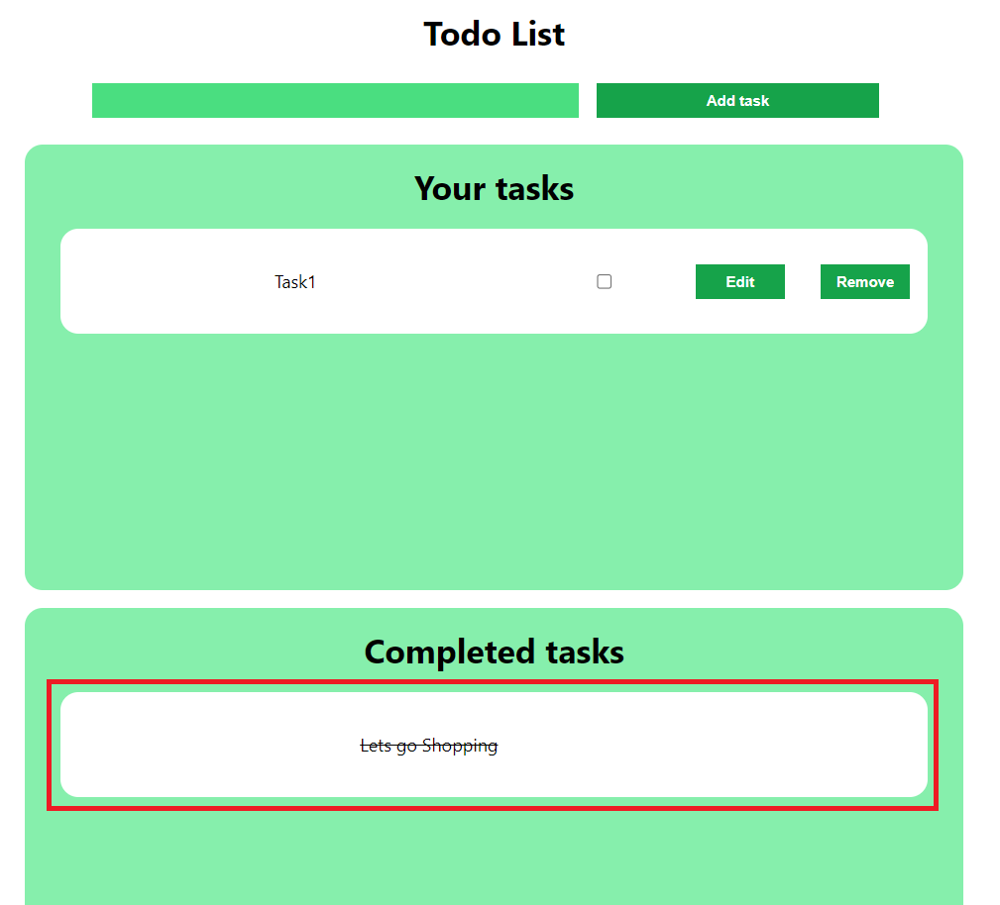
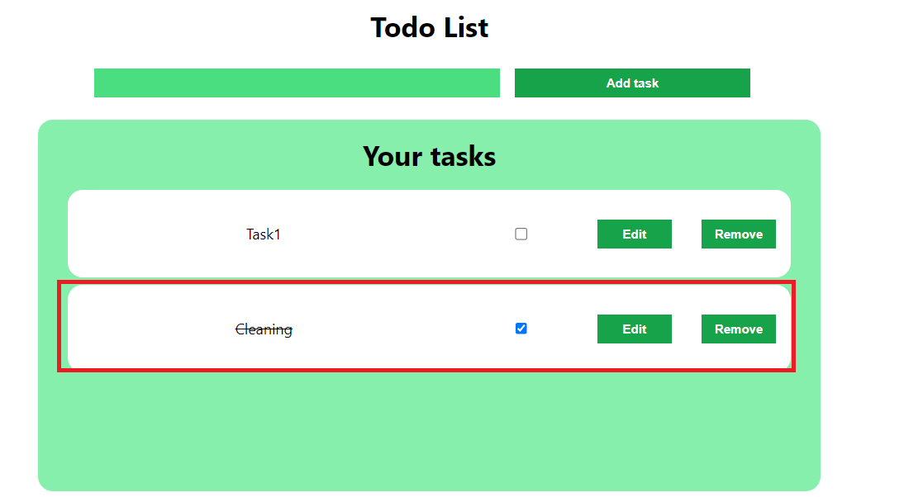
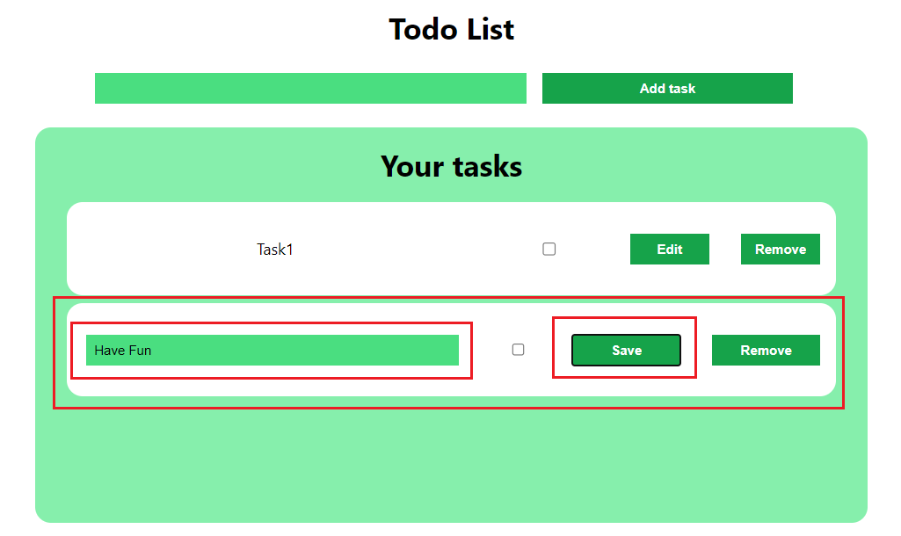

# Todo List Project

## Description

This project is a simple todo list application with the following features:

1. Add tasks to your list
2. Remove tasks from your list
3. Display completed tasks in a separate list
4. Mark tasks as completed using checkbox.
5. Edit existing tasks

## Screenshots

### Add Task

### Remove Task

### Display Completed Tasks

### Mark Task as Completed

### Edit Task

## Usage

- Clone the repository
- Run npm install
- Start your development server npm start.

## Technologies Used

- Primary : ReactJs
- HTML
- CSS
- JavaScript

## Credits

This project is created by the one & only Rahul Agarwal.😉
